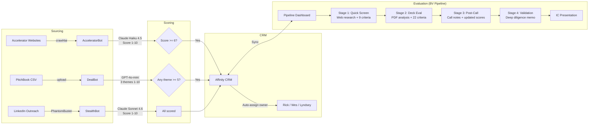

# Deal Flow Pipeline

---

---

## How Deals Flow Through the System

### Stage 1: Sourcing

Deals enter the system through three channels, each served by a dedicated bot:

- **AcceleratorBot** crawls 30+ accelerator websites using crawl4ai. It extracts company descriptions, team info, and any available metrics. This runs every Wednesday.
- **DealBot** processes PitchBook CSV exports. When a CSV file is uploaded to the `input/` directory of the repo, GitHub Actions triggers the scoring pipeline automatically.
- **StealthBot** handles inbound founder outreach. It pulls data from a Google Sheet, enriches profiles via PhantomBuster LinkedIn scraping, and scores the founders. This runs four times per week.

### Stage 2: Scoring

Each bot uses a different LLM but follows the same rubric structure defined in the bv-rubrics repo:

- **AcceleratorBot** uses Claude Haiku 4.5 to score companies 1-10. Companies scoring 6 or above are pushed to Affinity.
- **DealBot** uses GPT-4o-mini to score across three investment themes (Sustainable Industry, Human Health, Workforce), each 1-10. Companies with any theme score of 5 or above are pushed to Affinity.
- **StealthBot** uses Claude Sonnet 4.6 to score founders 1-10. All scored founders are pushed to Affinity regardless of score.

### Stage 3: CRM Assignment

When a company or founder lands in Affinity, it is automatically assigned an owner based on thesis fit. Rick handles climate and sustainability deals, Wes handles health and bioeconomy, and Lyndsey handles workforce and circular economy.

### Stage 4: Evaluation in BV Pipeline

The team uses the BV Pipeline dashboard to evaluate deals through four progressive stages:

1. **Quick Screen** — The AI researches the company on the web and scores it across 9 criteria. This is a first-pass filter.
2. **Deck Eval** — A pitch deck PDF is uploaded and analyzed across 22 criteria covering team, market, product, traction, and financials.
3. **Post-Call** — After a call with the founder, the team pastes their notes. The AI integrates the new information and updates scores.
4. **Validation** — A deep diligence analysis that produces a comprehensive memo suitable for an investment committee presentation.

Each stage builds on the previous one. The dashboard syncs status changes back to Affinity so the CRM always reflects the current pipeline state.
