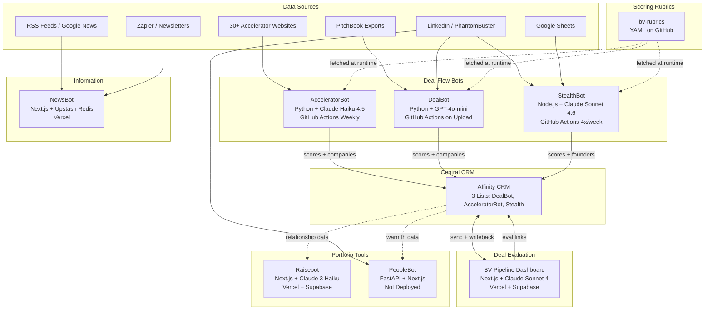

# System Ecosystem

---

---

## How It All Fits Together

The BV engineering ecosystem has three layers: sourcing, evaluation, and portfolio support.

**Sourcing** happens through three bots that each watch a different channel. AcceleratorBot crawls 30+ accelerator websites weekly, looking for startups that match BV's investment themes. DealBot processes PitchBook CSV exports whenever they are uploaded. StealthBot monitors LinkedIn outreach from founders and scores them based on Google Sheet data enriched with PhantomBuster scrapes. All three bots pull their scoring criteria from the centralized bv-rubrics repository at runtime, ensuring consistent evaluation standards.

**Affinity CRM** sits at the center. Every bot pushes scored companies or founders into one of three Affinity lists. Affinity is the system of record — it holds deal status, owner assignments, notes, and relationship data. The BV Pipeline dashboard syncs bidirectionally with Affinity: it pulls companies in for evaluation and writes status updates and evaluation links back.

**Evaluation** happens in the BV Pipeline dashboard. The team moves deals through four stages — Quick Screen, Deck Eval, Post-Call, and Validation — with AI assistance at each stage. Each stage adds more depth to the analysis.

**Portfolio support** tools operate independently. Raisebot helps portfolio companies find investors by matching company profiles against an investor database enriched with Affinity relationship data. NewsBot aggregates RSS feeds, Google News, and newsletter content into personalized dashboards for each team member. PeopleBot (not yet deployed) is designed for executive recruiting with LinkedIn data and Affinity warmth scoring.
