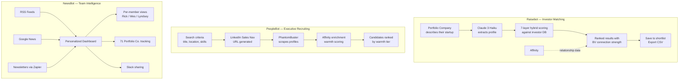

# Portfolio & Information Tools

---

---

## Raisebot — Investor Matching

Raisebot helps BV portfolio companies find the right investors for their next fundraise. The workflow:

1. A portfolio company (or a BV team member on their behalf) types a description of the startup into the AI Matching box.
2. Claude 3 Haiku extracts a structured profile from the description — stage, sector, geography, business model, and other attributes.
3. The profile is scored against the investor database using a 7-layer hybrid scoring system that evaluates fit across multiple dimensions (sector focus, stage preference, check size range, geographic overlap, and more).
4. Results are ranked and enriched with BV connection strength data from Affinity. This shows which BV team member has a relationship with each investor and how strong it is — making warm introductions possible.
5. The team can save investors to shortlists and export to CSV for sharing with the portfolio company.

## PeopleBot — Executive Recruiting

PeopleBot is designed to help portfolio companies find executive talent. It is built but not yet deployed. The intended workflow:

1. The user enters search criteria — job title, location, skills, industry experience.
2. The system generates a LinkedIn Sales Navigator search URL based on those criteria.
3. PhantomBuster scrapes the matching LinkedIn profiles.
4. Each candidate is enriched with Affinity data to determine if anyone on the BV team (or in the broader BV network) has a connection to them.
5. Candidates are ranked by warmth tier — first-degree connections surface at the top, making it easy to prioritize candidates the team can reach through existing relationships.

## NewsBot — Team Intelligence

NewsBot keeps the BV team informed without requiring them to check dozens of sources manually.

- **RSS Feeds and Google News** are aggregated into a single dashboard. Each team member has their own view with feeds tailored to their focus areas.
- **Newsletter content** from sources like StrictlyVC, Pitchbook Daily, and others flows in automatically via Zapier integrations.
- **Portfolio company tracking** monitors news mentions for 71 companies in the BV portfolio, collected in the "PortCos" tab.
- **Slack sharing** lets team members push relevant articles directly to Slack channels with one click.
- **Time filtering** (1 day, 7 days, 30 days) lets users control how far back to browse, keeping the feed manageable.

All feed data is stored in Upstash Redis. The application runs on Vercel with no LLM calls — it is purely an aggregation and display tool.
